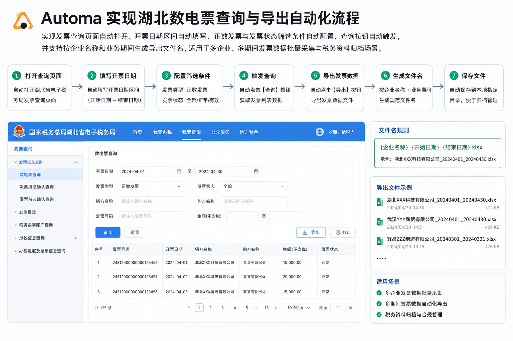
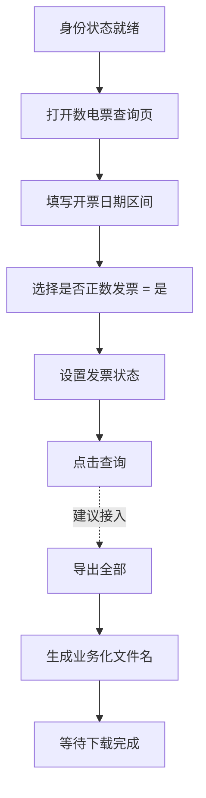

# 基于 Automa 的数电票查询与导出自动化实践



在企业税务场景中，数电票查询和导出是一类高频、规则明确但人工操作成本较高的任务。操作人员通常需要进入发票查询页面，设置开票日期、发票类型、发票状态等筛选条件，再执行查询并导出结果。这个过程看似简单，但一旦涉及多家公司、多期间、多条件组合，就会消耗大量重复劳动。

本文基于一个 Automa 工作流文件 `全量自动化.automa (1).json`，从工程实现角度拆解其自动化设计。文章聚焦前置环境就绪后的核心业务链路：进入数电票查询页面、设置查询条件、触发查询、生成导出文件名并下载结果。

## 一、自动化目标

这个流程的目标可以概括为一句话：将“人工进入数电票页面并导出指定期间发票数据”的操作，封装为可重复执行的浏览器自动化流程。

具体包括四个动作：

1. 打开数电票查询页面。
2. 自动填写开票日期区间。
3. 自动设置“是否正数发票”“发票状态”等筛选条件。
4. 查询结果并预留“导出全部”的下载交付能力。

从实现方式看，这不是单纯依赖录制点击的低代码流程，而是 Automa 节点与 JavaScript 脚本结合的方案。Automa 负责流程编排，JavaScript 负责处理复杂页面组件。

## 二、整体流程结构

该自动化流程采用“主流程 + 子流程”的组织方式。主流程负责调度，子流程负责处理具体业务条件。

核心子流程包括：

- `全量发票11`：打开数电票查询页，并填写开票日期区间。
- `正数-是`：选择“是否正数发票”为“是”。
- `发票正常`：设置发票状态筛选条件。
- `发票导出`：抓取公司名称，生成导出文件名，触发“导出全部”并等待下载。

这种拆分方式有两个好处。第一，业务动作边界清晰，后续维护时可以单独修改日期、状态或导出逻辑。第二，常用动作可以复用，避免把所有点击和脚本堆在主流程中。



## 三、进入查询页并填写日期

`全量发票11` 子流程首先打开数电票查询页面：

```text
https://dppt.hubei.chinatax.gov.cn:8443/invoice-query/invoice-query
```

页面打开后，流程设置了较长等待时间，用于等待税务系统前端资源和查询表单加载完成。随后通过 JavaScript 按 placeholder 定位开票日期输入框，并写入固定日期区间：

```js
[
  { placeholder: "开票日期起", value: "2025-10-01" },
  { placeholder: "开票日期止", value: "2025-12-31" }
]
```

这里的重点不只是给输入框赋值，而是赋值后主动派发 `input`、`change` 和 `keydown` 事件。税务系统前端通常由 Vue、TDesign 等组件框架构建，直接修改 DOM 的 `value` 不一定会同步到组件内部状态。补充事件派发可以让框架感知输入变化，降低“页面看起来填了值，但查询参数没有生效”的风险。

当前日期区间是硬编码配置，适合一次性任务。若要长期使用，建议改为 Automa 变量，例如：

```text
invoiceStartDate = 2025-10-01
invoiceEndDate = 2025-12-31
```

这样每次调整期间时，只需要修改变量，不需要进入脚本改代码。

## 四、设置“是否正数发票”

`正数-是` 子流程负责设置“是否正数发票”字段。它没有依赖坐标点击，而是通过 XPath 从表单 label 出发，定位该字段对应的输入框：

```xpath
//label[contains(text(),'是否正数发票')]/ancestor::div[contains(@class,'t-form__item')]//input
```

这种定位方式比绝对 CSS 路径更稳健。只要页面仍然保留“是否正数发票”这个字段名，即便 DOM 层级发生轻微调整，脚本仍有机会正常工作。

在选项确认环节，脚本会查找 TDesign 下拉菜单中的高亮项：

```js
document.querySelector('.t-select-option.t-is-focused, .t-select-option.t-is-hover')
```

找到后通过鼠标事件模拟点击，而不是直接按 Enter。这个细节很重要，因为在复杂查询页里，Enter 可能被全局表单监听并触发查询，导致下拉框尚未选完就提前提交。通过点击高亮选项，可以更精确地完成选择动作。

脚本还设置了备选逻辑：如果没有找到高亮项，则遍历 `.t-select-option`，直接点击文本为“是”的选项。这让流程对组件状态的波动有一定容错能力。

## 五、设置发票状态

`发票正常` 子流程负责配置“发票状态”。它同样从 label 文本出发：

```js
const label = Array.from(document.querySelectorAll('label'))
  .find(el => el.textContent.trim() === '发票状态');
```

找到 label 后，再向上定位表单项容器，并在容器内部查找 `input.t-input__inner`。这种“先找语义字段，再找附近输入控件”的策略，比直接写一个长 CSS 选择器更适合政务系统、税务系统这类前端结构复杂的页面。

当前实现通过键盘序列选择多个状态：

```text
ArrowDown, ArrowDown, Enter, ArrowDown, Enter, ArrowDown, Enter
```

这说明流程很可能要选择多个可用发票状态。脚本在每次按键之间加入 250ms 间隔，并在最后发送 Escape 和 blur，用来关闭下拉菜单、结束输入状态。

不过，这里也存在一个维护风险：键盘序列依赖选项顺序。如果税务系统调整了下拉列表排序，脚本可能会选错状态。更推荐的长期方案是展开下拉框后按可见文本定位目标选项，例如按“正常”“已红冲”“部分红冲”等明确文本逐项点击。

## 六、点击查询的实现策略

流程中多处使用了“按按钮文本点击查询”的脚本。典型逻辑如下：

```js
const buttons = Array.from(document.querySelectorAll('button.t-button'));
const searchBtn = buttons.find(btn => btn.textContent.trim() === '查询');

if (searchBtn) {
  searchBtn.click();
}
```

这个策略比录制坐标更可靠，因为它关注的是页面语义，而不是按钮出现的位置。税务系统的查询页可能会因为屏幕分辨率、浏览器缩放、表单折叠状态不同而导致坐标变化，但“查询”按钮的文本通常更稳定。

脚本还提供了备用选择器：

```js
button[type="submit"].t-button--theme-primary
```

这相当于在文本匹配失败时，用组件库样式和按钮类型兜底。对于自动化流程来说，这种“双重定位”可以显著提高可运行概率。

## 七、导出与文件命名设计

`发票导出` 子流程是整个流程的交付环节。它先从页面中抓取公司名称，再拼接业务化文件名：

```js
const fileName = `${companyName}，四季度开具发票.xlsx`;
automaSetVariable('finalFileName', fileName);
```

之后，脚本点击“导出”按钮，等待下拉菜单出现，再点击“导出全部”。最后由 Automa 的 Handle Download 节点接管下载文件，并使用变量作为文件名：

```text
{{variables.finalFileName}}
```

这部分设计比较完整。它没有让浏览器保存默认文件名，而是把公司名称和业务期间写进文件名，便于后续归档、检索和交付。

需要注意的是，在当前流程结构中，`发票导出` 子流程已经实现，但主链路尚未完整接入该子流程。也就是说，导出能力存在，但还需要从“查询结果加载完成”之后连接到导出节点，才能形成真正的端到端自动化。

## 八、工程亮点

这套流程的价值不在于“能点按钮”，而在于它用较工程化的方式处理了浏览器自动化中最容易出问题的几个环节。

首先，它优先使用 label、placeholder、按钮文本等语义信息定位元素，而不是依赖坐标。这让流程更能适应页面布局变化。

其次，它重视前端组件状态同步。无论是日期输入，还是下拉选择，脚本都会派发 `input`、`change`、`keydown`、`mousedown`、`mouseup` 等事件，确保 Vue/TDesign 组件内部状态能够跟上 DOM 变化。

再次，它通过子流程拆分降低维护成本。日期、正数发票、发票状态、导出分别封装，后续某一项规则变化时，只需要调整对应子流程。

最后，它把下载文件名纳入自动化设计。对于税务数据这类需要归档的文件，仅仅下载成功是不够的，文件命名也必须服务后续管理。

## 九、可优化方向

当前流程已经具备可运行基础，但如果要作为长期稳定工具使用，建议继续优化以下几点。

第一，将日期区间变量化。把 `2025-10-01` 和 `2025-12-31` 改成 Automa 变量，便于按月、按季或按年度复用。

第二，将发票状态选择从键盘序列改为文本匹配。这样可以降低选项顺序变化带来的风险。

第三，减少重复脚本。多个子流程中都存在类似的“点击查询”逻辑，可以抽象成统一子流程或统一脚本片段。

第四，补齐导出链路。建议在查询后增加“等待结果表格出现”或“等待导出按钮可点击”的判断，再连接 `发票导出` 子流程。

第五，减少对构建属性的依赖。类似 `data-v-a9af69c8` 这类属性可能随前端构建变化，长期看应优先使用文本、label、placeholder 和组件语义结构定位。

## 十、结语

这个 Automa 工作流展示了一种实用的税务自动化实现方式：用 Automa 负责流程编排，用 JavaScript 处理复杂前端组件，用子流程组织业务动作，再用下载节点完成结果交付。

对于数电票查询这类重复性强、规则明确、页面交互复杂的业务，低代码节点加脚本增强是一种很合适的组合。它既保留了 Automa 的可视化编排优势，也通过代码补足了组件状态同步、元素精准定位和异常兜底能力。

当日期、状态和导出链路进一步参数化后，这套流程就可以从一次性自动化脚本，升级为可复用的发票数据采集工具。


本插件代码由 Google Gemini 生成，人工测试并修改后发布。