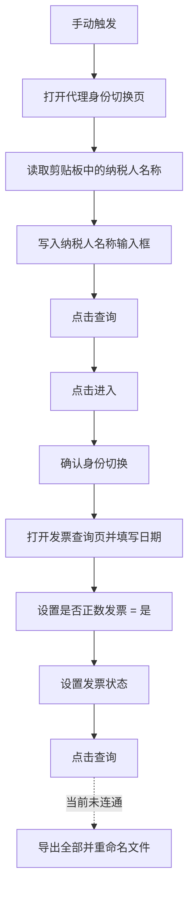

# 用 Automa 打通湖北税务发票查询自动化：从身份切换到批量导出的一次工程化拆解

在这套自动化方案里，Automa 被用来承接一个典型的税务门户操作链路：先在湖北省电子税务局完成代理身份切换，再进入数电票查询页面，批量设置筛选条件，查询发票数据，并预留导出全部数据的能力。整个实现不是简单的“录制点击”，而是把页面跳转、剪贴板输入、DOM 精准定位、异步等待、子流程复用和下载命名串成了一条可维护的浏览器自动化流水线。

本文基于目录下两个 Automa 工作流文件进行分析：

- `身份切换.automa.json`
- `全量自动化.automa (1).json`

两个文件的结构高度相似，主流程均包含 18 个节点，并内嵌 4 个子流程：`正数-是`、`发票正常`、`全量发票11`、`发票导出`。主要差异在于，`全量自动化` 比 `身份切换` 多了一条从“点击确认”继续进入发票查询配置阶段的连线，因此它更接近完整业务流程；`身份切换` 则更像一个身份切换阶段的版本快照。

## 一、业务目标与自动化边界

这套流程解决的是“多步骤税务系统人工操作”的自动化问题。人工操作时，用户通常需要复制纳税人名称，打开湖北税务统一身份切换页面，搜索并进入代理企业身份，再切换到发票查询页面，设置开票日期、是否正数发票、发票状态等条件，最后查询并导出数据。

Automa 在这里承担了三类职责：

1. 页面编排：打开身份切换页、进入查询页、调用不同子流程。
2. 表单交互：把剪贴板里的纳税人名称写入输入框，选择下拉筛选项，点击查询按钮。
3. 数据交付：从页面抓取公司名称，生成导出文件名，并等待浏览器下载。

从工程角度看，这不是一个单点脚本，而是一条由主流程和子流程组成的自动化管道。



## 二、主流程：先完成身份，再进入业务页面

主流程的入口是手动触发器。触发后，Automa 打开以下地址：

```text
https://tpass.hubei.chinatax.gov.cn:8443/#/identitySwitch/agent
```

这一步对应湖北税务的代理身份切换页面。流程随后等待 1500ms，再通过 Clipboard 节点读取系统剪贴板，并将内容保存到 Automa 变量 `clipboardData`。

这里的设计点很实用：纳税人名称没有硬编码在流程里，而是通过剪贴板注入。这意味着用户只需要在执行前复制公司名称，同一个流程就可以复用于不同主体。

读取变量后，JS 节点会把 `clipboardData` 填入页面上的纳税人名称输入框：

```js
const input = document.querySelector('input[placeholder="请输入纳税人名称"]');
```

脚本没有直接 `input.value = textToPaste` 后结束，而是调用了 `HTMLInputElement.prototype.value` 的原生 setter，并额外派发 `input`、`change` 事件。这一点非常关键。税务系统前端大概率由 Vue 或类似框架驱动，直接改 DOM 值可能不会同步到组件状态；使用原生 setter 加事件派发，可以让框架层正确感知输入变化。

之后流程执行三个身份切换动作：

- 精准定位 Element UI 的“查询”按钮并点击。
- 等待查询结果中的“进入”按钮出现，滚动到视口中后点击。
- 等待确认弹窗，点击 Element UI 主按钮样式下的“确定”。

这一段实现明显考虑了页面异步加载和组件库事件机制。例如“进入”按钮使用最多 10 秒的轮询等待，“确定”按钮使用 5 秒轮询，并检查按钮尺寸，避免点到隐藏元素。

## 三、子流程拆分：把业务筛选条件模块化

完整流程内嵌了 4 个子流程。这样的拆分方式是可取的，因为税务系统查询条件常会调整，把每个条件独立成子流程，比把所有点击都堆在主流程里更容易维护。

### 1. `全量发票11`：进入数电票查询页并设置日期

该子流程打开：

```text
https://dppt.hubei.chinatax.gov.cn:8443/invoice-query/invoice-query
```

打开后等待 12 秒，再填写开票日期区间：

```js
[
  { placeholder: "开票日期起", value: "2025-10-01" },
  { placeholder: "开票日期止", value: "2025-12-31" }
]
```

脚本通过 placeholder 定位日期输入框，写入值后派发 `input`、`change`，并补发一次 Enter 键。这个策略的目的同样是同步组件内部状态，尤其适合 TDesign、Vue 这类受控输入组件。

需要注意的是，子流程里存在一个“点击查询按钮”的 JS 节点，但当前连线只到“填写日期”节点为止，没有继续连到该查询节点。因此实际执行时，日期填写完成后子流程就结束，查询动作由后续主流程或其他子流程触发。

### 2. `正数-是`：选择是否正数发票

该子流程先激活当前标签页，然后通过 XPath 定位“是否正数发票”表单项下的 input：

```xpath
//label[contains(text(),'是否正数发票')]/ancestor::div[contains(@class,'t-form__item')]//input
```

随后使用键盘向下选择，并通过 JS 查找 `.t-select-option.t-is-focused` 或 `.t-select-option.t-is-hover` 的高亮选项进行点击确认。这个实现细节很有价值：它避免单纯按 Enter 导致页面全局查询被误触发。

如果找不到高亮项，脚本会退化为直接点击文本为“是”的选项。最后再点击 TDesign 的“查询”按钮。

### 3. `发票正常`：设置发票状态

该子流程从 label 文本“发票状态”出发，找到对应表单容器，再定位其中的 `input.t-input__inner`。随后执行一串键盘动作：

```text
ArrowDown, ArrowDown, Enter, ArrowDown, Enter, ArrowDown, Enter
```

这表示流程可能在选择多个发票状态选项。脚本把每次操作间隔控制在 250ms，并在最后发送 Escape、blur 收尾，关闭下拉菜单。

从稳定性角度看，这种键盘序列依赖选项顺序。如果税务系统调整下拉选项排序，流程可能会选择错误状态。更稳健的方案是直接按选项文本定位并点击，而不是靠第几个 ArrowDown。

### 4. `发票导出`：生成文件名并导出全部

导出子流程的设计思路是：

- 从页面的公司名称元素中读取企业名称。
- 拼接导出文件名，例如：`某某公司，四季度开具发票.xlsx`。
- 保存到 Automa 变量 `finalFileName`。
- 点击“导出”按钮，展开下拉菜单。
- 点击“导出全部”。
- 使用 Automa 的 Handle Download 节点等待下载，并把文件名设置为 `{{variables.finalFileName}}`。

这是一种比较完整的下载交付设计。它没有让浏览器保存一个默认文件名，而是把业务语义写进文件名里，便于后续归档和识别。

不过当前主流程中，导出子流程的入口节点处于未连通状态。也就是说，`发票导出` 子流程虽然已经写好，但在 `全量自动化` 主链路中不会被自动执行。要实现真正的端到端自动导出，需要把最终查询完成后的节点连接到“延迟 1000ms -> 执行发票导出”的分支。

## 四、实现亮点：不是录制点击，而是面向组件状态编程

这套流程最值得肯定的是，它没有完全依赖坐标点击或录制回放，而是大量使用 DOM、文本、class、XPath 和事件派发来和页面组件交互。

几个关键技术点包括：

- 使用 `automaRefData('variables', 'clipboardData')` 读取 Automa 变量，并增加 10 次重试，规避变量异步写入延迟。
- 使用原生 input setter 写入值，绕过前端框架对输入框 value 的代理限制。
- 补发 `input`、`change`、`keydown`、`mousedown`、`mouseup` 等事件，提高 Vue/Element UI/TDesign 组件响应概率。
- 使用轮询等待按钮出现，而不是固定等待到底，提升对网络和页面渲染速度差异的适应性。
- 按文本匹配按钮，例如“查询”“进入”“确定”“导出全部”，比坐标和 DOM 层级路径更可维护。
- 通过子流程复用筛选条件配置，让后续调整日期、状态、导出逻辑时不必重写主链路。

这些做法体现了一个重要原则：浏览器自动化的稳定性不只取决于“能不能点到”，更取决于是否能让前端框架内部状态与 DOM 表现保持一致。

## 五、当前风险与可改进点

第一，导出链路尚未接入主流程。`发票导出` 子流程存在，但当前没有从查询完成节点连到该子流程的有效边。建议在最后一次查询后增加等待结果加载的节点，再连接到导出子流程。

第二，部分查询按钮脚本重复出现。主流程、`正数-是`、`发票正常`、`全量发票11` 中都有类似的 TDesign 查询按钮点击逻辑。后续可以保留一个标准子流程，减少重复维护成本。

第三，日期区间是硬编码的 `2025-10-01` 到 `2025-12-31`。如果这是季度任务，建议改为 Automa 变量或全局配置，例如 `invoiceStartDate`、`invoiceEndDate`，避免每个季度手动改 JS。

第四，`发票状态` 的选择依赖键盘顺序。只要下拉项顺序变化，结果就有偏差。建议改成展开下拉后按可见文本匹配具体状态。

第五，部分选择器带有构建产物属性，例如 `data-v-a9af69c8`、`data-v-1f9709c8`。这类属性可能随前端构建版本变化。更推荐优先使用文本、placeholder、label 语义、表单容器关系等选择器。

第六，等待策略可以更语义化。当前存在 500ms、1000ms、12000ms 等固定延迟。固定延迟简单但不够优雅：网络慢时可能不够，网络快时浪费时间。后续可以更多使用“等待某个元素出现”或“等待按钮可点击”的逻辑。

## 六、推荐的端到端执行顺序

按当前设计意图，一个完整的稳定版本应当是：

1. 复制目标纳税人名称。
2. 手动触发 Automa 主流程。
3. 打开代理身份切换页。
4. 从剪贴板读取纳税人名称并填入查询框。
5. 查询代理身份，点击进入，确认切换。
6. 打开数电票查询页。
7. 设置开票日期范围。
8. 设置“是否正数发票”为“是”。
9. 设置目标发票状态。
10. 点击查询并等待结果加载完成。
11. 执行导出全部。
12. 使用企业名称和季度信息生成业务化文件名。
13. 等待下载完成并覆盖同名文件。

## 七、结论

这两个 Automa 流程已经具备一个专业自动化脚本的雏形：它通过主流程编排业务路径，通过子流程封装筛选条件，通过 JS 直接处理复杂组件状态，并通过下载节点接管最终文件交付。相比普通录制式自动化，它更接近“可维护的浏览器 RPA”。

当前最需要补齐的是端到端闭环：把查询结果页与 `发票导出` 子流程连通，并把日期、季度、发票状态等业务参数变量化。完成这两点后，这套流程就可以从“可运行脚本”升级为“可复用、可配置、可交付”的税务发票自动化工具。
