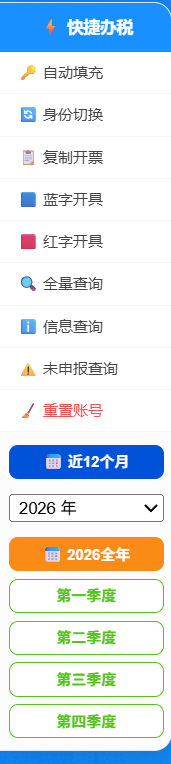

## 简介

这是一个专为**湖北省电子税务局**（`*.hubei.chinatax.gov.cn`）设计的 Chrome 扩展插件，解决日常办税中几个重复性高、容易出错的操作：

- 自动将金额转换为**万单位**显示，大额一键高亮
- 实时计算并展示**价税合计**
- 在页面左侧提供**快捷导航菜单**
- 跨域**自动填充登录**凭证（只需配置一次）
- 一键填入**日期范围**，快速查询发票

## 安装方法

### 1. 下载源码

插件完整代码在文章末尾，将以下三个文件保存到本地文件夹：

```
css/
├── manifest.json
├── content.js
└── icon.png
```

### 2. 加载插件

1. 打开 Chrome，进入 `chrome://extensions/`
2. 打开右上角 **"开发者模式"**
3. 点击 **"加载已解压的扩展程序"**
4. 选择存放上述文件的文件夹

### 3. 使用效果



加载后，打开湖北省电子税务局任意页面即可自动生效。

## 主要功能

### 1. 金额万单位转换

页面中的金额数字（如 `info-number` 元素）会自动在后方显示对应的**万元**数值。点击金额可直接**复制**原始数值到剪贴板。

超过 30 万的金额会以**红色高亮**显示。

### 2. 价税合计

页面顶部会固定显示**金额 + 税额的合计值**，点击即可复制，方便填写报表时直接引用。

### 3. 快捷办税菜单

页面左侧有一个可展开的快捷导航菜单，包含常用功能入口：

| 功能 | 说明 |
|------|------|
| 🔑 自动填充 | 一键填写纳税人信用代码、手机号、密码 |
| 🔄 身份切换 | 跳转至身份切换页面 |
| 📋 复制开票 | 跳转至发票复制页面 |
| 🟦 蓝字开具 | 蓝字发票开具 |
| 🟥 红字开具 | 红字发票开具 |
| 🔍 全量查询 | 发票全量查询 |
| ℹ️ 信息查询 | 纳税人信息查询 |
| ⚠️ 未申报查询 | 批量申报未申报查询 |
| 🧹 重置账号 | 清空已保存的账号信息 |

菜单下方还提供**日期快捷查询**按钮——近 12 月、全年、各季度，一键填充开票日期范围并自动点击查询。

### 4. 跨域账号自动填充

只需在任意办税页面**首次配置**一次信用代码、手机号和密码，所有湖北省税务局的子域名都会自动使用同一份凭证数据（通过 `chrome.storage.local` 存储）。

密码标签页切换到密码登录模式后，插件会自动填充三个输入框。

### 5. 特定发票类型高亮

表格中所有"数电发票（增值税专用发票）"的单元格会自动以红色加粗高亮，方便快速定位。

## 完整源码

### manifest.json

```json
{
  "manifest_version": 3,
  "name": "金额计算与高亮工具",
  "version": "1.4",
  "description": "自动转换金额为万单位，高亮特定值，提供价税合计及跨域账号同步填充。",
  "permissions": [
    "clipboardWrite",
    "storage"
  ],
  "host_permissions": [
    "*://*.hubei.chinatax.gov.cn/*"
  ],
  "content_scripts": [
    {
      "matches": [
        "*://dppt.hubei.chinatax.gov.cn/*",
        "*://etax.hubei.chinatax.gov.cn/*",
        "*://tpass.hubei.chinatax.gov.cn/*"
      ],
      "js": ["content.js"],
      "run_at": "document_idle"
    }
  ],
  "icons": {
    "48": "icon.png"
  }
}
```

### content.js

```javascript
const config = {
    totalAmountSelector: ".info-number:nth-child(1)",
    totalTaxSelector: ".info-number:nth-child(2)",
    highlightThreshold: 300000,
    highlightColor: "#ff4d4f",
    storageKey: "plugin_tax_user_info"
};

const textConfig = {
    selector: ".t-table__ellipsis.t-text-ellipsis",
    targetText: "数电发票（增值税专用发票）",
    highlightColor: "#ff4d4f"
};

const quickNavConfig = {
    allowedDomains: ["hubei.chinatax.gov.cn"],
    links: [
        { name: "自动填充", url: "javascript:void(0)", onclick: (e) => handleAutoLogin(e), target: "_self" },
        { name: "身份切换", url: "https://tpass.hubei.chinatax.gov.cn:8443/#/identitySwitch/agent" },
        { name: "复制开票", url: "https://dppt.hubei.chinatax.gov.cn:8443/blue-invoice-makeout/invoice-copy" },
        { name: "蓝字开具", url: "https://dppt.hubei.chinatax.gov.cn:8443/blue-invoice-makeout/invoice-makeout" },
        { name: "红字开具", url: "https://dppt.hubei.chinatax.gov.cn:8443/red-invoice/info-confirm?id=2" },
        { name: "全量查询", url: "https://dppt.hubei.chinatax.gov.cn:8443/invoice-query/invoice-query" },
        { name: "信息查询", url: "https://etax.hubei.chinatax.gov.cn:8443/szzh/zhcx/nsrxxcx" },
        { name: "未申报查询", url: "https://etax.hubei.chinatax.gov.cn:8443/xxbg/view/zhsffw/#/sszyfwjgplsb/plsbzh" },
        { name: "重置账号", url: "javascript:void(0)", onclick: (e) => resetCredentials(), target: "_self" }
    ]
};

const state = {
    lastTotalText: "",
    selectedYear: new Date().getFullYear(),
    isRunning: false,
    isPrompting: false
};

function nativeFill(input, value) {
    if (!input) return;
    const setter = Object.getOwnPropertyDescriptor(HTMLInputElement.prototype, 'value').set;
    setter.call(input, value);
    input.dispatchEvent(new Event('input', { bubbles: true }));
    input.dispatchEvent(new Event('change', { bubbles: true }));
    input.dispatchEvent(new KeyboardEvent('keydown', { key: 'Enter', code: 'Enter', bubbles: true }));
}

function getSavedCredentials(callback) {
    chrome.storage.local.get([config.storageKey], (result) => {
        let saved = result[config.storageKey];
        if (!saved) {
            if (state.isPrompting) return;
            state.isPrompting = true;
            const code = prompt("首次使用配置 - 请输入信用代码:");
            const num = prompt("请输入手机/证件号码:");
            const pwd = prompt("请输入登录密码:");
            state.isPrompting = false;
            if (code && num && pwd) {
                const data = { code, num, pwd };
                chrome.storage.local.set({ [config.storageKey]: data }, () => callback(data));
            }
        } else {
            callback(saved);
        }
    });
}

function resetCredentials() {
    if (confirm("确定要清空已保存的账号吗？")) {
        chrome.storage.local.remove(config.storageKey, () => alert("账号信息已清空"));
    }
}

function handleAutoLogin(e) {
    getSavedCredentials((creds) => {
        if (!creds) return;
        const tab = Array.from(document.querySelectorAll('span, .t-tabs__item'))
            .find(el => el.innerText.includes('密码'));
        tab?.click();
        setTimeout(() => {
            const fill = (sel, v) => { const el = document.querySelector(sel); if(el) nativeFill(el, v); };
            fill('input[placeholder*="信用代码"]', creds.code);
            fill('input[placeholder*="号码"]', creds.num);
            fill('input[type="password"]', creds.pwd);
        }, 400);
    });
}

function fillDateAndSearch(start, end) {
    const targets = [
        { p: "开票日期起", v: start },
        { p: "开票日期止", v: end }
    ];
    targets.forEach(item => {
        const input = document.querySelector('input[placeholder="' + item.p + '"]');
        if (input) { nativeFill(input, item.v); input.blur(); }
    });
    setTimeout(() => {
        const sBtn = Array.from(document.querySelectorAll('button.t-button, button.el-button'))
            .find(b => b.textContent.includes('查询'));
        if (sBtn) sBtn.click();
    }, 800);
}

function copyToClipboard(text, event) {
    if (event) { event.preventDefault(); event.stopPropagation(); }
    navigator.clipboard.writeText(text).then(() => {
        const tip = document.createElement("div");
        tip.innerText = "已复制";
        const x = event ? event.clientX : window.innerWidth / 2;
        const y = event ? event.clientY : window.innerHeight / 2;
        tip.style.cssText = [
            "position: fixed; left: " + x + "px; top: " + (y - 30) + "px;",
            "transform: translateX(-50%); background: #52c41a; color: white;",
            "padding: 4px 8px; border-radius: 4px; font-size: 11px;",
            "z-index: 2147483647; pointer-events: none;",
            "animation: tipFadeUp 0.8s ease-out forwards;",
            "white-space: nowrap; box-shadow: 0 4px 10px rgba(0,0,0,0.15);"
        ].join(" ");
        if (!document.getElementById('plugin-anim-style')) {
            const style = document.createElement('style');
            style.id = 'plugin-anim-style';
            style.innerHTML = '@keyframes tipFadeUp { 0% { opacity: 0; transform: translate(-50%, 5px); } 20% { opacity: 1; transform: translate(-50%, 0); } 100% { opacity: 0; transform: translate(-50%, -10px); } }';
            document.head.appendChild(style);
        }
        document.body.appendChild(tip);
        setTimeout(() => tip.remove(), 800);
    });
}

function updateDateButtons(container) {
    container.querySelectorAll('.dynamic-date-btn').forEach(b => b.remove());
    const year = state.selectedYear;
    const createBtn = (txt, start, end, color) => {
        const b = document.createElement('button');
        b.className = 'dynamic-date-btn';
        b.textContent = txt;
        b.style.cssText = "width: 100%; padding: 5px 0; margin-top: 5px; cursor: pointer; border: 1px solid " + color + "; background: white; color: " + color + "; border-radius: 6px; font-size: 10px; font-weight: 600;";
        if (txt.includes("全年")) { b.style.background = "#fa8c16"; b.style.color = "white"; b.style.borderColor = "#fa8c16"; }
        b.onclick = () => fillDateAndSearch(start, end);
        container.appendChild(b);
    };
    createBtn(year + "全年", year + "-01-01", year + "-12-31", "#fa8c16");
    [{n:"一季度"},{n:"二季度"},{n:"三季度"},{n:"四季度"}].forEach((q,i) => {
        const mStart = (i*3+1).toString().padStart(2,'0');
        const mEnd = ((i+1)*3).toString().padStart(2,'0');
        createBtn(q.n, year+"-"+mStart+"-01", year+"-"+mEnd+"-30", "#52c41a");
    });
}

function createQuickNavMenu() {
    const id = "plugin-quick-nav";
    if (document.getElementById(id)) return;
    const menu = document.createElement("div");
    menu.id = id;
    menu.style.cssText = "position: fixed; left: 0; top: 15%; width: 12px; height: auto; background: white; border: 1px solid #e4e7ed; border-radius: 0 12px 12px 0; box-shadow: 6px 0 20px rgba(0,0,0,0.15); z-index: 2147483647; overflow: hidden; transition: width 0.3s; cursor: pointer;";
    const wrap = document.createElement("div"); wrap.style.width = "115px"; menu.appendChild(wrap);
    menu.onmouseenter = () => menu.style.width = "115px";
    menu.onmouseleave = () => menu.style.width = "12px";

    const title = document.createElement("div");
    title.innerText = "快捷办税";
    title.style.cssText = "background: #1890ff; color: white; padding: 10px 0; font-size: 11px; text-align: center; font-weight: bold;";
    wrap.appendChild(title);

    quickNavConfig.links.forEach(link => {
        const a = document.createElement("a");
        a.innerText = link.name; a.href = link.url; a.target = link.target || "_blank";
        const isR = link.name.includes("重置");
        a.style.cssText = "display: block; padding: 8px 12px; color: " + (isR ? "#ff4d4f" : "#444") + "; text-decoration: none; font-size: 10px; border-bottom: 1px solid #f5f7fa; white-space: nowrap;";
        if (link.onclick) a.onclick = link.onclick;
        wrap.appendChild(a);
    });

    const dBox = document.createElement('div');
    dBox.id = "plugin-date-box"; dBox.style.cssText = "padding: 8px 6px; background: #fcfcfc;";
    const d = new Date();
    const pad = (n) => String(n).padStart(2,'0');
    const s12 = (d.getFullYear()-1) + "-" + pad(d.getMonth()+1) + "-" + pad(d.getDate()+2);
    const e12 = d.getFullYear() + "-" + pad(d.getMonth()+1) + "-" + pad(d.getDate()+1);

    const fixB = document.createElement('button');
    fixB.textContent = "近12个月";
    fixB.style.cssText = "width: 100%; padding: 5px 0; margin-bottom: 8px; border: 1px solid #0052d9; background: #0052d9; color: white; border-radius: 6px; font-size: 10px; font-weight: bold; cursor: pointer;";
    fixB.onclick = () => fillDateAndSearch(s12, e12);
    dBox.appendChild(fixB);

    const sel = document.createElement('select');
    sel.style.cssText = "width: 100%; padding: 2px; font-size: 11px; margin-bottom: 5px; cursor: pointer;";
    for (let y = d.getFullYear(); y >= d.getFullYear() - 5; y--) {
        const opt = document.createElement('option'); opt.value = y; opt.textContent = y + " 年";
        if(y === state.selectedYear) opt.selected = true;
        sel.appendChild(opt);
    }
    sel.onchange = (e) => { state.selectedYear = parseInt(e.target.value); updateDateButtons(dBox); };
    dBox.appendChild(sel);
    updateDateButtons(dBox);
    wrap.appendChild(dBox);
    document.body.appendChild(menu);
}

function runBusiness() {
    if (state.isRunning || state.isPrompting) return;
    state.isRunning = true;
    try {
        const amtEl = document.querySelector(config.totalAmountSelector);
        const taxEl = document.querySelector(config.totalTaxSelector);
        if (!amtEl || !taxEl) { state.isRunning = false; return; }

        const amtStr = (amtEl.firstChild?.textContent || "0").replace(/,/g, "").replace(/[^\d.-]/g, "");
        const taxStr = (taxEl.firstChild?.textContent || "0").replace(/,/g, "").replace(/[^\d.-]/g, "");
        const total = (parseFloat(amtStr) + parseFloat(taxStr)).toFixed(2);

        [amtEl, taxEl].forEach((el, i) => {
            const v = parseFloat(i === 0 ? amtStr : taxStr);
            if (v > config.highlightThreshold && i === 0) el.style.color = config.highlightColor;
            let wan = el.querySelector(".wan-unit-display") || document.createElement("span");
            if (!wan.parentElement) {
                wan.className = "wan-unit-display";
                wan.style.cssText = "margin-left: 6px; font-weight: bold; color: #1890ff; background: #e6f7ff; padding: 1px 4px; border-radius: 4px; cursor: pointer;";
                el.appendChild(wan);
            }
            wan.innerText = "(" + (v / 10000).toFixed(2) + "万)";
            wan.onclick = (e) => copyToClipboard(i === 0 ? amtStr : taxStr, e);
        });

        let tEl = document.getElementById("total-tax-fixed-display") || document.createElement("div");
        if (!tEl.parentElement) {
            tEl.id = "total-tax-fixed-display";
            tEl.style.cssText = "position: fixed; font-size: 13px; font-weight: bold; color: white; background: #1f1f1f; padding: 6px 12px; border-radius: 6px; z-index: 10000; cursor: pointer;";
            document.body.appendChild(tEl);
        }
        if (state.lastTotalText !== total) { tEl.innerText = "价税合计: " + total; state.lastTotalText = total; }
        tEl.onclick = (e) => copyToClipboard(total, e);
        const rect = amtEl.getBoundingClientRect();
        if (rect.top > 0) { tEl.style.left = rect.left + "px"; tEl.style.top = (rect.top - 45) + "px"; }

        document.querySelectorAll(textConfig.selector).forEach(el => {
            if (el.textContent.includes(textConfig.targetText)) {
                el.style.setProperty("color", config.highlightColor, "important");
                el.style.setProperty("font-weight", "bold", "important");
            }
        });
    } catch(e) {} finally { state.isRunning = false; }
}

setInterval(() => {
    runBusiness();
    createQuickNavMenu();
}, 1500);
```

> 完整源码文件（含 icon）可在本博客仓库的 `src/content/blog/css/` 目录下找到。

---

*本插件代码由 Google Gemini 生成，人工测试并修改后发布。*
